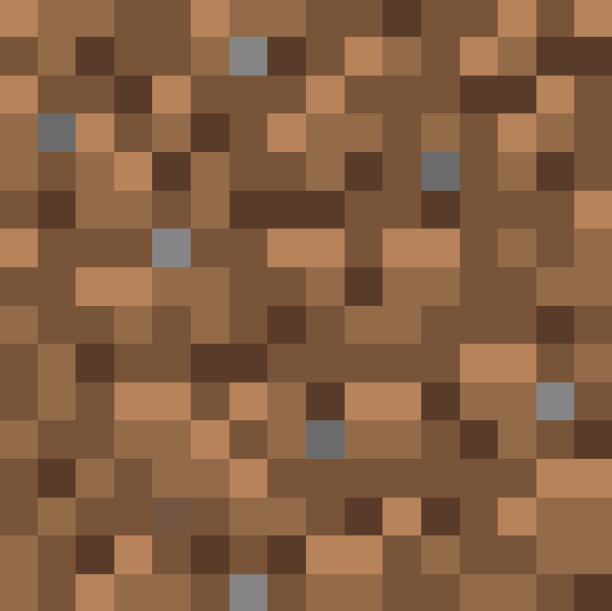
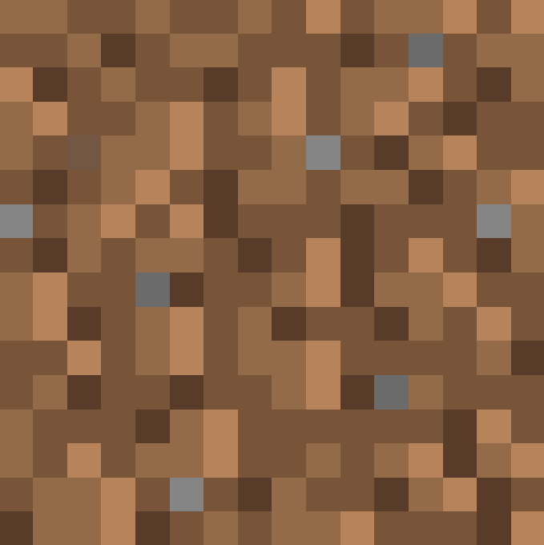
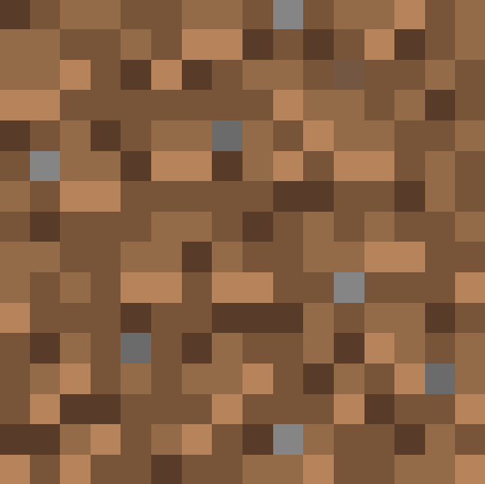
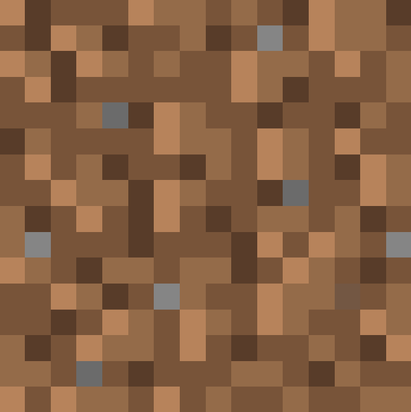

# dirt-cl

A tool that uses OpenCL to identify block positions from multiple Minecraft dirt block texture orientations.

## Features

- Search and predict dirt block texture orientation patterns
- High-speed computation with GPU parallel processing
- Search with specified coordinate ranges and facing directions

## Build

```sh
git submodule update --init --recursive
cmake -B ./build
cmake --build ./build
```

## Usage

```sh
./dirt-cl -f <facing> -x <minX> -X <maxX> -y <minY> -Y <maxY> -z <minZ> -Z <maxZ> -r <rotations> -v <dataVersion>
```

### Options

- `-f`: Facing direction (optional, `north`, `east`, `south`, `west`)
- `-x`, `-X`: X coordinate range (required, set minimum by -x, maximum by -X)
- `-y`, `-Y`: Y coordinate range (required, set minimum by -y, maximum by -Y)
- `-z`, `-Z`: Z coordinate range (required, set minimum by -z, maximum by -Z)
- `-r`, `-p`: List of block rotations (required)
  - `-r`: Comma-separated list of values 0-3 representing top surface texture rotation. The first element corresponds to the base Y coordinate, and each subsequent element corresponds to Y+1, Y+2, etc.
  - `-p`: Comma-separated list of json in format: `{dx: number, dy: number, dz: number, r: rotation}`
    | rotation = 0 | rotation = 1 | rotation = 2 | rotation = 3 |
    |:------------:|:------------:|:------------:|:------------:|
    |||||
- `-v`: [Data version](https://minecraft.wiki/w/Data_version) specifying the client version (optional, default INT_MAX, means latest version)
- `--platform`: Index of the platform to use (optional, default 0)
- `--device`: Index of the device to use (optional, default 0)
- `--kernel`: Path to src/kernel.cl file (optional)

### Example

```txt
$ ./dirt-cl -v 4440 -f east -x -100000 -X 100000 -y 63 -Y 80 -z -100000 -Z 100000 -r 3,2,1,2,0,3,3,1,2,1,0,2,1,0,3,3,3,1,3,3,3,2,2,3,2,2,2,0,1,2,2,2
kernel:
  type: embedded
  size: 5365 bytes
platforms:
  #0: NVIDIA CUDA
  #1: Intel(R) OpenCL
  #2: Intel(R) FPGA Emulation Platform for OpenCL(TM)
  #3: Intel(R) FPGA SDK for OpenCL(TM)
selected platform:
  name: NVIDIA CUDA
  version: OpenCL 3.0 CUDA 12.6.65
devices:
  #0: NVIDIA GeForce RTX 4090
selected device:
  name: NVIDIA GeForce RTX 4090
  version: OpenCL 3.0 CUDA
result:
  5.48 seconds elapsed
  x=-74857, y=73, z=-57818
```

```txt
$ ./dirt-cl --kernel src/kernel.cl -f east -x -100000 -X 100000 -y 63 -Y 80 -z -100000 -Z 100000 -p {dx:0,dy:0,dz:0,r:3},{dx:0,dy:1,dz:0,r:2},{dx:0,dy:3,dz:0,r:1}
```
